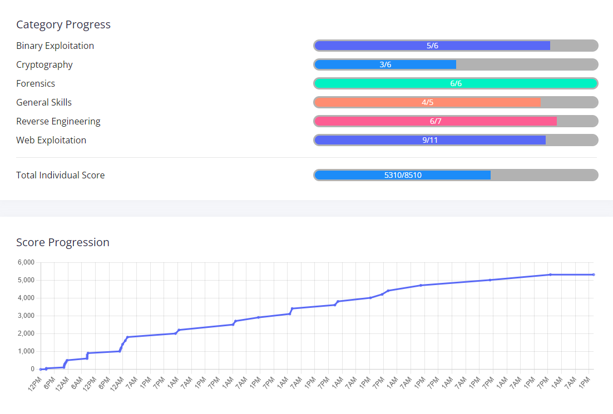

Decided to dabble in a bit of cybersecurity and capture the flag (CTF) style challenges. For my first-ever CTF competition, I decided to participate in [picoCTF 2025](www.picoctf.org), which ran from March 17-27th. 

I was really happy with my result, placing 36th in the high school category! 

I learned a lot of web exploitation, reading assembly and exploiting binaries through format string vulnrebilites or heap overflows, and forensics with system images. I learned many tools like Burp for web exploitation, gdb for debugging, and Ghidra for reverse engineering!

Below are some writeups on how I tackled each challenge!

## Writeups
Note - The flags WILL NOT work for you, because they are unique to each player. The flags I show are truncated to preserve just the leetspeak messages.

**Work in progress - more coming soon**

    
Web Exploitation

* [SSTI 1](ssti_1/ssti_1.md)
* [SSTI 2](ssti_2/ssti_2.md)
* [n0s4n1ty 1](n0s4n1ty_1/n0s4n1ty_1.md)
* [head-dump](head_dump/head_dump.md)
* [Cookie Monster Secret Recipe](cookie_monster/cookie_monster.md)
* [Pachinko](pachinko/pachinko.md)
* [3v@l](3v@l/3v@l.md)
* [WebSockFish](websockfish/websockfish.md)
* [Apriti sesamo](apriti_sesamo/apriti_sesamo.md)

    
Cryptography

* [hashcrack](hashcrack/hashcrack.md)
* [EVEN RSA CAN BE BROKEN???](rsa/rsa.md)
* [Guess My Cheese (Part 1)](cheese_1/cheese_1.md)

    
Reverse Engineering

* [Flag Hunters](flag_hunters/flag_hunters.md)
* [Quantum Scrambler](quantum_scrambler/quantum_scrambler.md)
* [Chronohack](chrono_hack/chrono_hack.md)
* [Tap into Hash](tap_into_hash/tap_into_hash.md)

    
Forensics

* [RED](red/red.md)
* [Ph4nt0m 1ntrud3r](ph4nt0m_1ntrud3r/ph4nt0m_1ntrud3r.md)
* [flags are stepic](flags_are_stepic/flags_are_stepic.md)
* [Event-Viewing](event_viewing/event_viewing.md)
* [Bitlocker-1](bitlocker_1/bitlocker_1.md)
* [Bitlocker-2](bitlocker_2/bitlocker_2.md)

    
General Skills

The General skills this year were easy (besides YaraRules0x100, which I didn't do).
* FANTASY CTF - Just follow instructions
* Rust fixme 1, 2 & 3 - Basic Rust syntaxing, just some quick googling.

    
Binary Exploitation (still working on writeups!)

* [PIE TIME](pie_time/pie_time.md)
* [PIE TIME 2](pie_time_2/pie_time_2.md)
* [hash-only-1](hash_only_1/hash_only_1.md)
* [hash-only-2](hash_only_2/hash_only_2.md)
* [Echo Valley](echo_valley/echo_valley.md)

