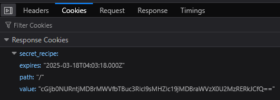

This just required basic knowledge of the web developer tools in any browser. I went into the network tab, inspected the cookies tab (since this question was obviously about cookies), and found what seemed like to be a base64 encoded value.

And then I used an online base64 decode tool to find the flag.