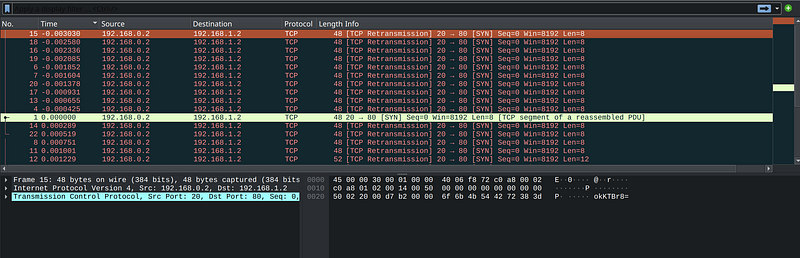

The challenge probides us with a Network Traffic PCAP file, so we'll have to use WireShark to analyze these payloads.

Since the hint tells us that the attacks where done in a timely manner, I sorted the packets by time. Each packet seemed to have a string at the end that was base64 encoded. I decoded each one, and then pieced together ones that seemed to be part of the flag. 