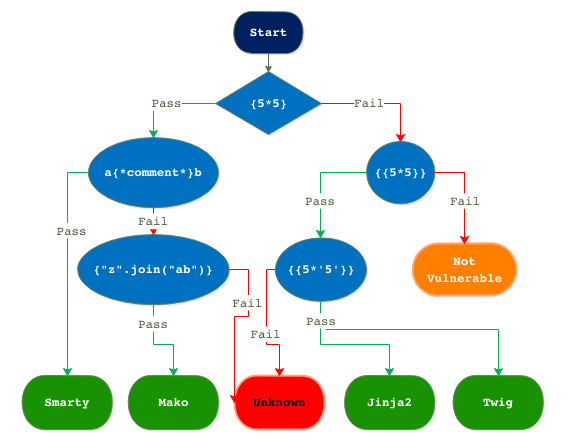

The hint tells us that server side templating is used. A quick google search shows that some popular ones are Django, Jinja2, Mako, or Cheetah. I found this handy flowchart to determine which one it was:



I tried `{{5*5}}`, and got an Internal Server Error, which is a good sign that something happened! By injecting `{{5*'5'}}`, we can tell if its Jinja2 or Twig. Since it printed `55555` and not `25`, I knew it was going to be Jinja2. Using [PayloadAllThings](https://github.com/swisskyrepo/PayloadsAllTheThings/blob/master/Server%20Side%20Template%20Injection/Python.md#jinja2---basic-injection) (fantastic repo filled with a bunch of injection exploits, I found a command that can execute shell commands. 
```
{{ self.__init__.__globals__.__builtins__.__import__('os').popen('ls').read() }}
```
From there, it was using `ls` and `cat` to find and read the flag.